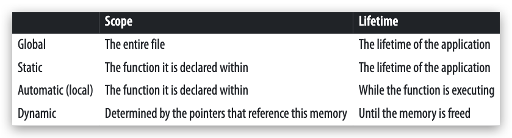
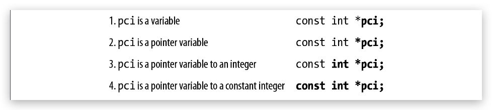
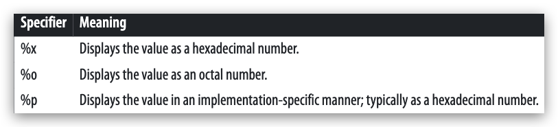
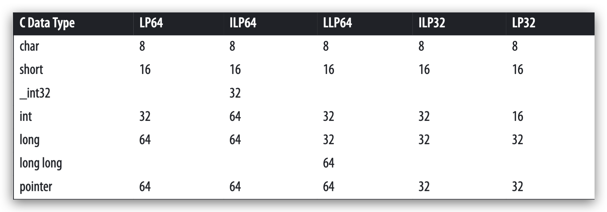
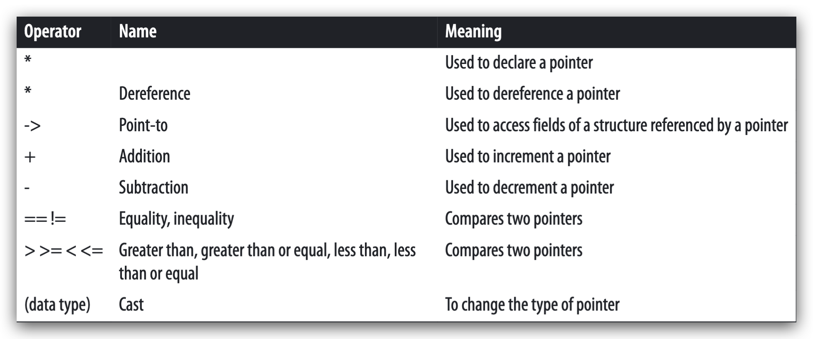

Notes for book [UNDERSTANDING AND USING C POINTERS](https://book.douban.com/subject/20491037/)

[TOC]

- [chapter 1 Introduction](#chapter-1-introduction)
  - [1.1 Pointers and Memory](#11-pointers-and-memory)
    - [1.1.1 Why You Should Become Proficient with Pointers](#111-why-you-should-become-proficient-with-pointers)
    - [1.1.2 Declaring Pointers](#112-declaring-pointers)
    - [1.1.3 How to Read a Declaration](#113-how-to-read-a-declaration)
    - [1.1.4 Address of Operator](#114-address-of-operator)
    - [1.1.5 Displaying Pointer Values](#115-displaying-pointer-values)
    - [1.1.6 Dereferencing a Pointer Using the Indirection Operator](#116-dereferencing-a-pointer-using-the-indirection-operator)
    - [1.1.7 Pointers to Functions](#117-pointers-to-functions)
    - [1.1.8 The Concept of Null](#118-the-concept-of-null)
  - [1.2 Pointer Size and Types](#12-pointer-size-and-types)
    - [1.2.1 Memory Models](#121-memory-models)
    - [1.2.2 Predefined Pointer-Related Types](#122-predefined-pointer-related-types)
  - [1.3 Pointer Operators](#13-pointer-operators)
    - [1.3.1 Pointer Arithmetic](#131-pointer-arithmetic)
    - [1.3.2 Comparing Pointers](#132-comparing-pointers)
  - [1.4 Common Uses of Pointers](#14-common-uses-of-pointers)
    - [1.4.1 Multiple Levels of Indirection](#141-multiple-levels-of-indirection)
    - [1.4.2 Constants and Pointers](#142-constants-and-pointers)
# chapter 1 Introduction
## 1.1 Pointers and Memory
### 1.1.1 Why You Should Become Proficient with Pointers
- When a C program is compiled, it works with three types of memory, as is shown:
    

### 1.1.2 Declaring Pointers
- There is nothing inherent to a pointer’s implementation that suggests what type ofdata it is referencing or whether its contents are valid.
- While a pointer may be used without being initialized, it may not always work properlyuntil it has been initialized.

### 1.1.3 How to Read a Declaration
- The trick is to read them backward.
- Reading the declaration backward allows us to progressively understand the declaration, as is shown:
    

### 1.1.4 Address of Operator
- When  working  with  complex  pointer  expressions,  draw  a  picture  ofthem, as we will do in many of our examples.Address of OperatorThe  address  of  operator,  &,  will  return  its  operand’s  address.
- It is a good practice to initialize a pointer as soon as possible, as illustrated below:
    ```c
    int num;
    int *pi;
    pi = &num;
    ```

### 1.1.5 Displaying Pointer Values
- The variable’s address can be determined by printing it out as follows:
    ```c
    int num = 0;
    int *pi = &num;

    printf("Address of num: %d  Value: %d\n", &num, num);
    printf("Address of pi: %d  Value: %d\n", &pi, pi);
    ```
- The printf function has a couple of other field specifiers useful when displaying pointer values, as is summarized:
    

### 1.1.6 Dereferencing a Pointer Using the Indirection Operator
- The indirection operator `*`, returns the value pointed to by a pointer variable. This is frequently referred to as dereferencing a pointer.
    ```c
    int num = 5;
    int *pi = &num;
    printf("%d\n", *pi);
    ```
- We can also use the result of the dereference operator as an lvalue. The term `lvalue` refers to the operand found on the left side of the assignment operator. All lvalues must be **modifiable** since they are being assigned a value.
    ```c
    int num;
    int *pi = &num;
    *pi = 200;
    printf("%d\n", num);
    ```

### 1.1.7 Pointers to Functions
- A pointer can be declared to point to a function. The declaration notation is a bit cryptic. The following illustrates how to declare a pointer to a function. The function is passed void and returns void. The pointer's name is foo:
    ```c
    void (*foo)();
    ```

### 1.1.8 The Concept of Null
- The concept of null is interesting and sometimes misunderstood. Confusion can occur because we often deal with several similar, yet distinct concepts, including:
    - The null concept
    - The null pointer constant
    - The NULL macro
    - The ASCII NUL
    - A null string
    - The null statement

## 1.2 Pointer Size and Types
### 1.2.1 Memory Models
- The model depends on the operating system and compiler. More than one model maybe supported on the same operating system; this is often controlled through compileroptions.
    

### 1.2.2 Predefined Pointer-Related Types

## 1.3 Pointer Operators
- Pointer operators is shown below:
    

### 1.3.1 Pointer Arithmetic
- Several arithmetic operations are performed on pointers to data. These include (These operations are not always permitted on pointers to functions.):
  - Adding an integer to a pointer
  - Subtracting an integer from a pointer
  - Subtracting two pointers from each other
  - Comparing pointers

### 1.3.2 Comparing Pointers

## 1.4 Common Uses of Pointers
### 1.4.1 Multiple Levels of Indirection
### 1.4.2 Constants and Pointers
1. Pointers to a constant
    - The declaration of pci as a pointer to a constant integer means:
      - pci can be assigned to point to different constant integers
      - pci can be assigned to point to different nonconstant integers
      - pci can be dereferenced for reading purposes
      - pci cannot be dereferenced to change what it points to
    - eg.
        ```c
        int num = 5;
        const int limit = 500;
        int *pi;
        const int *pci;

        pi = &num;
        pci = &limit;
        *pi = 6;
        *pci = 600; // illegal
        pci = &num;
        *pci = 6; // illegal
        ```

2. Constant pointers to nonconstants


